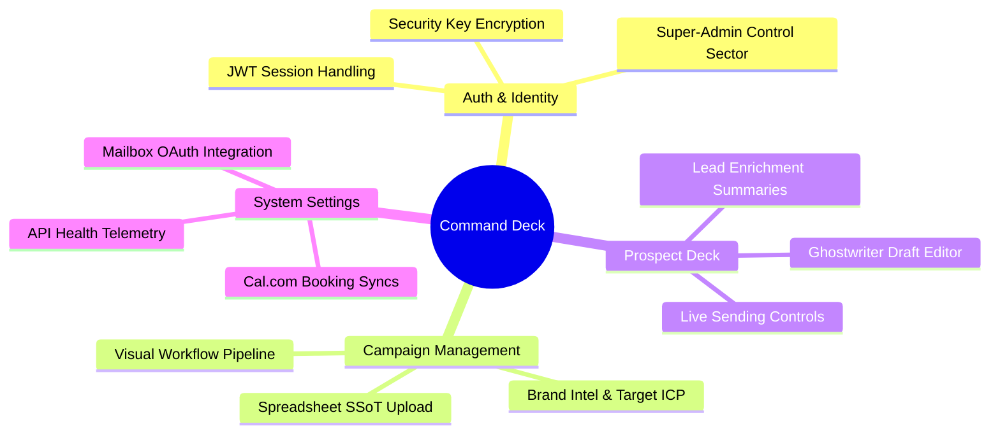

# 🎨 AI-PRIORI | Command & Control Portal (Frontend)

<div align="center">
  
  
  
  
</div>

---

## 📖 Overview

The **AI-PRIORI Frontend** is the command-and-control user interface for managing automated outbound B2B intelligence campaigns. It provides strategic operators with a high-fidelity portal to launch outreach missions, review AI-qualified leads, approve personalized draft variants, and monitor campaign telemetry charts in real time.

Built on **React 18** and bootstrapped using the **Vite JS** engine, the application is styled with Tailwind CSS and features premium dark-mode aesthetics, rich glassmorphism, responsive dashboard cards, and interactive micro-animations driven by Framer Motion.

---

## 💎 Core Interface Capabilities



---

## 🛠️ Tech Stack & Systems

* **Core Library**: React 18 (Hooks, Context API).
* **Build Tooling**: Vite JS (Hot Module Replacement, ultra-fast production bundle compilation).
* **Styling**: Tailwind CSS (Universal utility system for premium responsiveness and harmony).
* **Animations**: Framer Motion (Smooth hover transitions, sidebar slides, card fade-ins, and micro-interactions).
* **Routing**: React Router Dom v6 (Secure client-side route tracking, parameterized pages, dynamic layouts).
* **Icons**: Lucide React (Clean, minimalist iconography).

---

## 📂 Frontend Directory Structure

```text
frontend/
├── public/                 # Static public assets (logos, favicon)
├── src/
│   ├── assets/             # Global styling sheets, image variables
│   ├── components/         # Reusable layouts (Navbar, Sidebar, Tables, Telemetry Charts)
│   ├── context/            # Auth and global state context providers
│   ├── pages/              # High-fidelity sectoral page views
│   │   ├── Login.jsx       # Perimeter identity handshake
│   │   ├── Dashboard.jsx   # Live system overview and campaign charts
│   │   ├── Campaign.jsx    # Target ICP and multi-agent setup forms
│   │   ├── Prospects.jsx   # Enriched target companies and stakeholder decks
│   │   ├── Drafts.jsx      # Personalized Ghostwriter draft reviewing
│   │   ├── Settings.jsx    # Gmail stateless OAuth and Cal.com synchronization
│   │   └── Admin.jsx       # Sovereign control panel (Super-Admin)
│   ├── utils/              # Client fetch utilities and api bindings
│   ├── App.jsx             # Route parameters and global layout wrappers
│   └── main.jsx            # React root bootstrapper
├── index.html              # Entrance DOM structure
├── nginx.conf              # Production Nginx reverse proxy routing rules
├── package.json            # Script definitions and dependency charts
└── vite.config.js          # Vite HMR and API routing proxy configurations
```

---

## 🚀 Local Quickstart Guide

### Prerequisites
* [Node.js](https://nodejs.org/en/) (v18.0 or higher)
* [npm](https://www.npmjs.com/) package manager (comes pre-bundled with Node)

### 1. Environment Setup
Clone the repository and maneuver into your local frontend folder:
```bash
# Clone
git clone <your-frontend-repo-url> frontend
cd frontend
```

### 2. Dependency Resolution
Install the required packages:
```bash
npm install
```

### 3. Configure Local API Binding
Create a `.env` file in the root of the frontend directory to bind the client portal to the running backend service:
```env
VITE_API_URL=http://localhost:8000
```

### 4. Launch the Development Server
Spin up Vite's dev server:
```bash
npm run dev
```
Open your browser and navigate to: [http://localhost:5173](http://localhost:5173)

---

## 📦 Production Deployment

To compile the optimized, minified production assets, run:
```bash
npm run build
```

This compiles all files into the `/dist` directory. The output is a highly performant static bundle (HTML, JS, CSS) optimized for high-performance delivery.

### Nginx Configuration (Dockerized)
The repository includes a production-ready `nginx.conf` and a `Dockerfile` to package the UI into a container automatically. To build and run locally via Docker:
```bash
# Build Image
docker build -t ai-priori-frontend .

# Run Container
docker run -p 80:80 ai-priori-frontend
```

---

<div align="center">
  <p><i>Precision Navigational Deck | Protected Asset</i></p>
</div>
